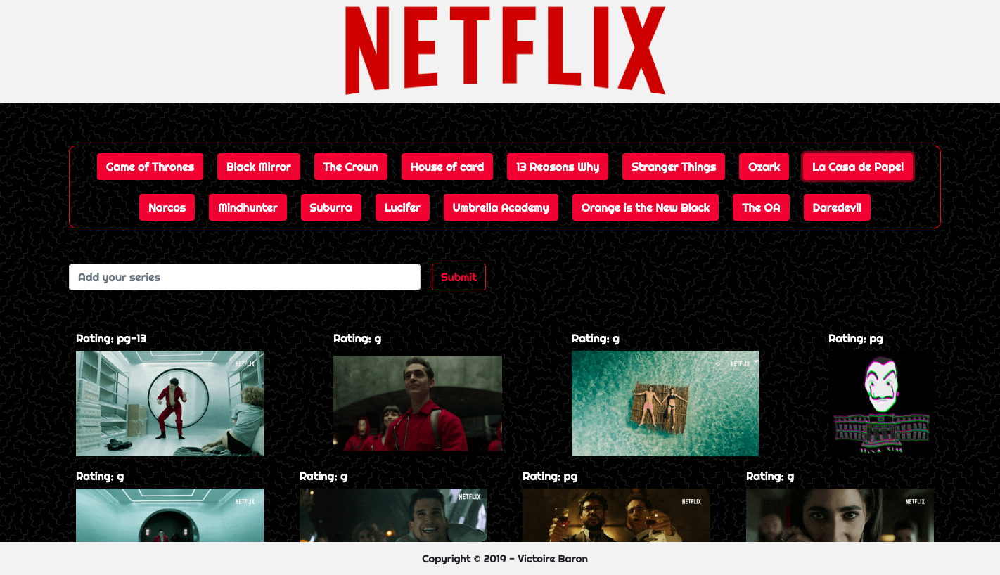

# GifTastic

## Quick start
Open [index](https://victoire44.github.io/GifTastic/) in your browser.

## Presentation
The purpose of this assignment is to create a page that offers many gifs about Netflix series. 
I use for that the [Giphy API](https://developers.giphy.com/).  

 
When you click on a button with the name of a series, 10 gifs in reference to the series are display. To animate the gif, you have to click on the image, and you have to click on again if you want to stop it. 
 
You can add your own series title by writing in the input. Then, you submit and a new button displays next to others. Click on to see the gifs.  

## Technologies Used

* [HTML](https://developer.mozilla.org/en-US/docs/Web/HTML)
* [CSS](https://developer.mozilla.org/en-US/docs/Web/CSS)
* [Bootstrap](https://getbootstrap.com/)
* [JavaScript](https://developer.mozilla.org/en-US/docs/Web/JavaScript)
* [jQuery](https://jquery.com/)
* [Ajax](https://developer.mozilla.org/en-US/docs/Web/Guide/AJAX)

## Author

Victoire Baron
